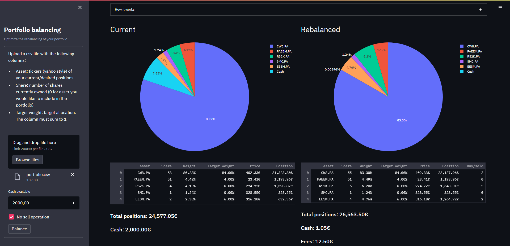

# Portfolio balance

Streamlit application to rebalance a portfolio of securities automatically, based on a target allocation and current market prices.

## Installation

Clone the repository by running the command:

`
git clone https://github.com/clabrugere/portfolio-balance.git
`

In a new environment, install the required packages:

`
pip install -r requirements.txt
`

_Note that you can change the `fees_func` in `src/portfolio.py` to adapt to your broker's fees logic._

## Usage

Upload a csv file with the following columns: 
* Asset: tickers (yahoo style "\<stock>.\<exchange>", e.g. "CW8.PA") of your current/desired positions
* Share: number of shares currently owned (0 for asset you would like to include in the portfolio)
* Weight: target allocation. The column must sum to 1

_Note that the security needs to be available in yahoo finance._

Select the amount of cash you want to invest, and click "Balance"

## How it works

It solves the non-linear problem with a non-linear constraint defined as:

where:

Because the independant variable is discrete, the objective and constraint non-linear (because $F$ is non linear), the optimal solution is searched using scipy implementation of Differential Evolution.

## License

[MIT](LICENSE)