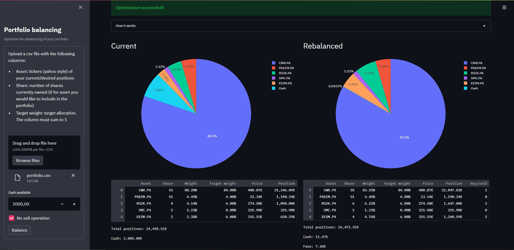

# Portfolio balance



Streamlit application I use to rebalance my portfolio of securities (stocks and ETFs) each time I credit cash to my
brokerage account. It finds the (quasi)-optimal set of operations to match a target allocation given current portfolio
state (quantity, market prices) and of course, desired allocation, with the least amount of cash remaining (including my
broker's fees).

## Installation

Clone the repository by running the command:

`
git clone https://github.com/clabrugere/portfolio-balance.git
`

### Run locally
In a new environment, install the required packages:

`
pip install -r requirements.txt
`

Launch the application:
```
streamlit run app.py
```

### Run from a Docker image
Build the Docker image:
```
docker build -t portfolio-balance .
```

Instantiate the image in a new container:
```
docker run -d --name portfolio-balance-instance -p 80:80 portfolio-balance
```

You can now access the application in your browser: `http://127.0.0.1`

_Note that you can change the `fees_func` in `src/portfolio.py` to adapt to your broker's fees logic._

## Usage

Upload a csv file with the following columns:

* Asset: tickers (yahoo style "\<stock>.\<exchange>", e.g. "CW8.PA") of your current/desired positions
* Share: number of shares currently owned (0 for asset you would like to include in the portfolio)
* Weight: target allocation. The column must sum to 1

_Note that the security needs to be available in yahoo finance._

Select the amount of cash you want to invest, and click "Balance"

## How it works

It solves the non-linear problem with a non-linear constraint defined as:


where:


Because the independant variable is discrete, the objective and constraint non-linear (because $F$ is non linear), the
optimal solution is searched using scipy implementation of Differential Evolution.

## License

[MIT](LICENSE)